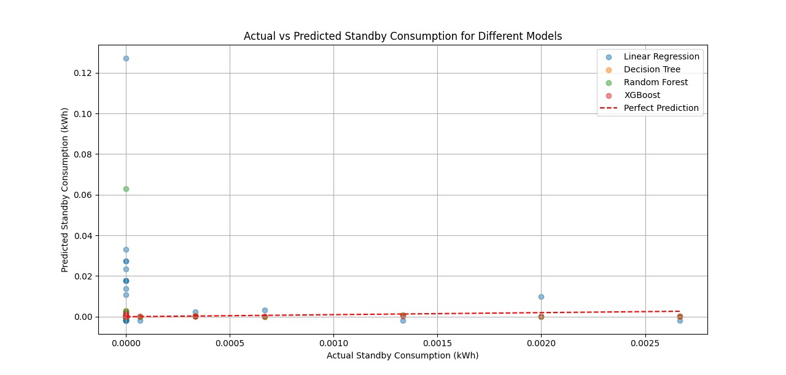
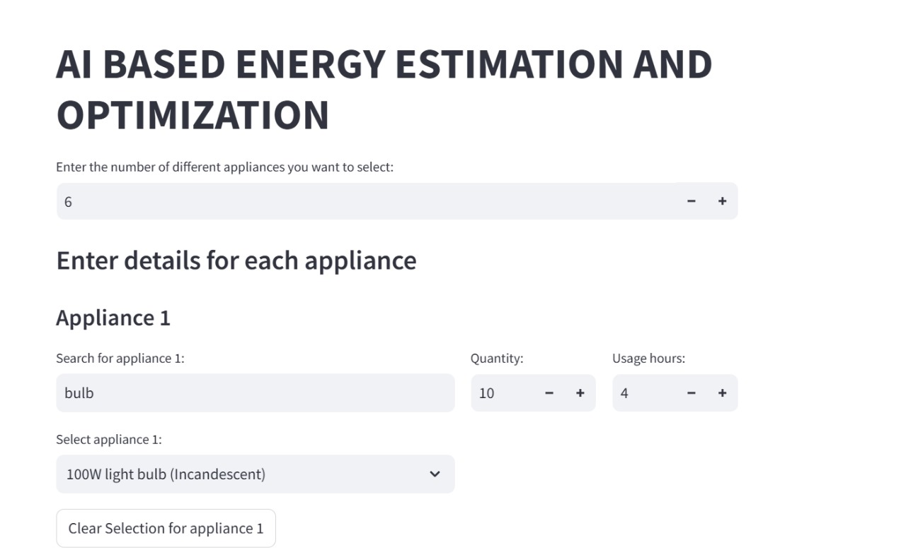
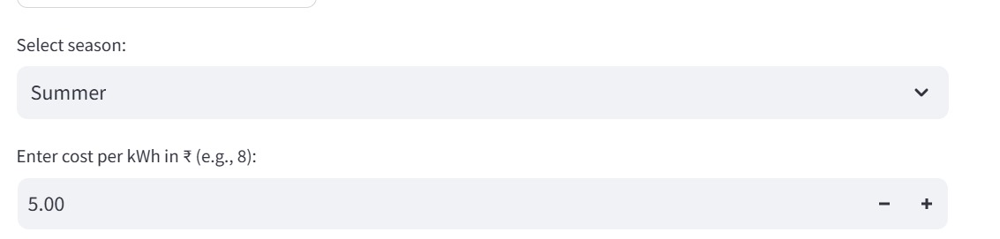
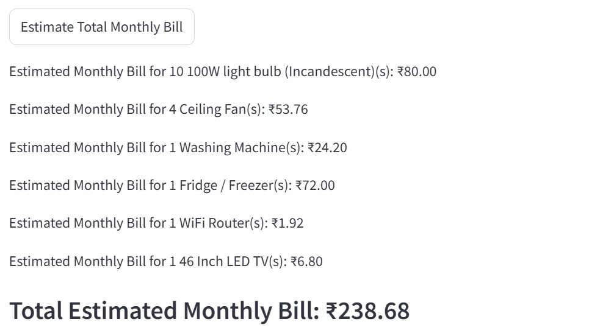
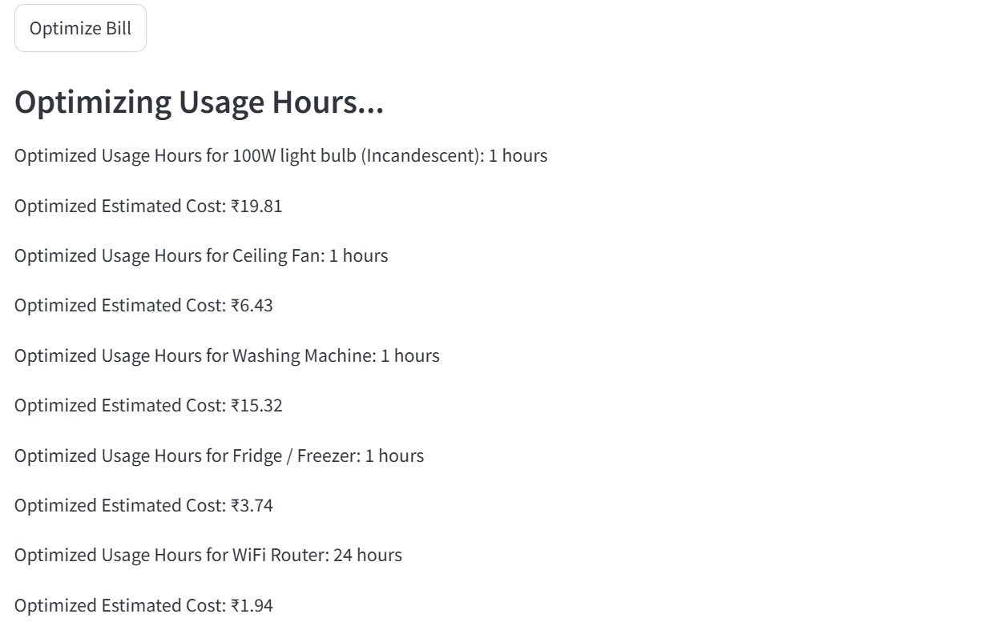
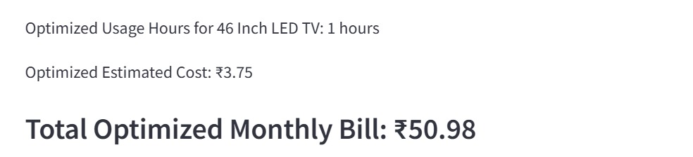
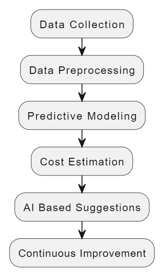

# Energy_App

---

## 🔌 AI-Based Energy Estimation and Optimization

This Streamlit-based web application estimates and optimizes electricity consumption and monthly costs for home appliances using **XGBoost regression**. By analyzing seasonal appliance usage data and power consumption, the app allows users to:

- Predict the estimated **monthly electricity bill** for various home appliances.
- **Optimize usage hours** for appliances to minimize electricity costs.
- Simulate energy usage across **different seasons** (Summer, Winter, Rainy).
- Input **appliance quantity**, usage time, and energy rates.

### 🚀 Features

- 📊 Uploads and reads normalized appliance energy data.
- ⚡ Uses **XGBoost** to train a regression model for cost estimation.
- 🧠 Suggests optimal usage hours to reduce monthly bills.
- 🔎 Search-enabled appliance selector for better UX.
- 📉 Visual display of individual and total energy costs.

### 📁 Dataset Format

The app requires a `Normalized_Energy_Consumption.csv` file in the root directory, with the following structure:

| Appliance | Minimum_kW | Summer_kWh | Winter_kWh | Rainy_kWh | Standby_kWh |
|-----------|-------------|-------------|-------------|------------|--------------|
| Fan       | 0.05        | 0.1         | 0.15        | 0.12       | 0.01         |
| AC        | 0.8         | 1.2         | 0.3         | 0.6        | 0.05         |
| ...       | ...         | ...         | ...         | ...        | ...          |

### 📌 Column Description

| Column Name     | Description                                                                 |
|-----------------|-----------------------------------------------------------------------------|
| `Appliance`     | Name of the electrical appliance (e.g., Fan, AC, TV).                       |
| `Minimum_kW`    | Minimum power consumption of the appliance in kilowatts.                   |
| `Summer_kWh`    | Energy consumed per hour (in kWh) during Summer.                            |
| `Winter_kWh`    | Energy consumed per hour (in kWh) during Winter.                            |
| `Rainy_kWh`     | Energy consumed per hour (in kWh) during Rainy season.                      |
| `Standby_kWh`   | Energy consumed per hour (in kWh) when the appliance is in standby mode.    |

> ⚠️ Make sure this file is located in the same folder as `app.py`.

### 🛠 Tech Stack

- 🐍 Python
- 📦 Pandas, NumPy
- ⚙️ XGBoost
- 🌐 Streamlit

### 🧮 How It Works

1. **Load CSV data** about appliances and their seasonal power consumption.
2. **Train an XGBoost model** using simulated usage patterns.
3. Input:
   - Appliance name
   - Usage hours per day
   - Appliance quantity
   - Season
   - Cost per unit (₹/kWh)
4. Get:
   - Estimated monthly electricity cost
   - Optimal usage time to minimize cost

### ▶️ Run the App

```bash
pip install -r requirements.txt
streamlit run XGBoost.py
```

## 📸 Screenshots

Here are some screenshots showcasing different aspects of the application:

### 📊 Model Comparison


#### 2. 🖥️ User Interface – Appliance Selection


#### 3. 🖥️ User Interface – Appliance Configuration


#### 4. 📈 Estimation Results – Monthly Bill


#### 5. 🧠 Optimized Usage Hours – Cost Reduction


#### 6. 💡 Detailed Appliance-Wise Cost


#### 7. 🔁 Program Flow (Draw.io)


#### 8. 🧱 System Architecture


#### 9. 📌 Screenshot of UI Output


1. **fig0.jpeg** - Overview of the application UI.
2. **fig1.jpeg** - Energy estimation interface displaying predictions.
3. **fig2.jpeg** - Appliance selection and filtering feature.
4. **fig3.jpeg** - Optimization recommendations for usage hours.
5. **fig4.jpeg** - Seasonal energy consumption comparison.
6. **fig5.jpeg** - Final cost breakdown and suggestions.
7. **flowchart.drawio.png** - System flowchart representation.
8. **Screenshot 2024-10-07 092601.png** - Example user input and output visualization.
9. **System Architecture.jpeg** - High-level architecture diagram of the system.

---
